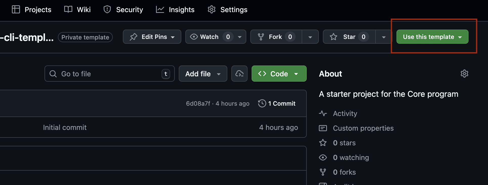
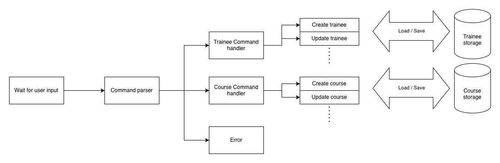

# School Management CLI

This is a template for a school management CLI application. The application will allow users to manage courses and trainees through a command-line interface.
Project specification and requirements can be found in the following link: https://hub.hackyourfuture.nl/core-program-week-7

## Setup

1. Click on "Use this template" to create a new repository on your GitHub account based on this template. 
2. Clone the newly created repository to your local machine.
3. Install the dependencies by running `npm install` in the terminal.
4. Start the application by running `npm start` in the terminal.

## Tests

To run the tests, use the command `npm test` in the terminal. This will execute all the test files in the `tests` directory.

## Folder Structure

- `src`: directory contains all the source code for your application. Those are the JavaScript files that will implement the logic for your CLI application.
- `tests`: directory contains all the test files for your application.
- `data`: directory will contain the data of the trainees and courses. This is where the data is saved.

## Architecture

High level of the architecture of the application

As you can see, the application is divided into several components:

- **Command Parser**: Responsible for parsing the user input, extracting the command, subcommand, and arguments, and returning them in a structured format.

- **Course/Trainee Command handler**: Reads the subcommand and calls the appropriate function with the arguments.

- **Storage**: Responsible for saving and loading data from a file. This will be used to persist the courses and trainee data.

## Source files

- `index.js`: The entry point of your application. It will ask the user for input, parse the command, and call the appropriate handler trainees handler / mentor handler based on the command.
- `command-parser.js`: Contains the logic to parse (read and process) the user input.
- `traineeCommands.js`: Contains functions related to trainee management, such as adding a trainee, listing trainees, etc.
- `courseCommands.js`: Contains functions related to course management, such as adding a course, listing courses, etc.
- `storage.js`: Contains functions to save and load data from a JSON file, which will be used to persist the courses and trainee data.

You may create additional files if needed.
